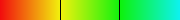

HeatMap
=======

Generate a PNG image of a heat map based on a given function passed as a block.

The inputs are:
 
 * width of image in number of pixels
 * height of image in number of pixels
 * number of contour lines to draw equally spaced in max-min range (defaults to no lines)
 * range of values for first parameter (x, horizontal, abcissa)
 * range of values for second parameter (y, vertical, ordinate)
 * the function to evaluate at each pixel of the image

The outputs are readeable as instance variables:

 * img, the png image generated and rotated
 * metadata stores the computed max, min and contour values
 * legend, a png of the the linear heatmap with contour lines

Define the block so:

 * x, y are the only vars (all else fix inside block)
 * x, y admit float values
 * last line of block returns a value (float)

Consider that when processing x,y follow image processing coordinates mapping:
 * x will be ordinate (from top to bottom) axis and
 * y the abscissa (left to right)
...but at the end we rotate the image counterclockwise 90 degrees so x becomes the horizontal axis.

#### Gem Requirements:

* Chunky_PNG
* Color
* NArray

#### Example:

```ruby
Nonsense_function = ->(x,y) do
  (x**2 + y**2)
end

h = HeatMap.new :width => 300, :height => 300, :contours => 2,
    :x_range => (0..10), 
    :y_range => (0..10), 
    &Nonsense_function

h.generate_image
h.save_img('output.png')
h.legend.save('output_legend.png', :fast_rgb)
puts h.metadata.inspect
```





